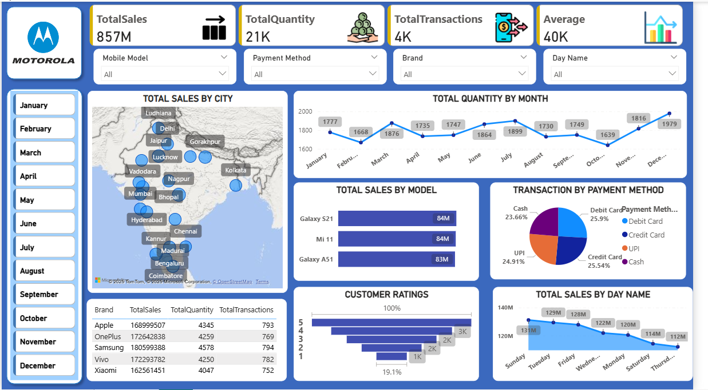

# 📊 Motorola Sales Performance Dashboard

A **Power BI Project by Harshit Tiwari**

This repository contains an interactive **Motorola Sales Analysis Dashboard** built using **Power BI**. It provides a complete view of sales performance across cities, brands, models, customer ratings, and payment methods.

---

## 🚀 Project Overview
This dashboard helps businesses and data analysts:
- Track **Total Sales**, **Total Quantity**, **Total Transactions**, and **Average Sales**
- Compare performance by **brand**, **model**, **city**, **month**, and **day**
- Understand customer behavior and purchasing patterns
- Identify trends for better **decision-making**

---

## 📌 Key Insights from the Dashboard
### 🔹 1. **Business KPIs**
- **Total Sales:** 857M
- **Total Quantity Sold:** 21K
- **Total Transactions:** 4K
- **Average Sales:** 40K

### 🔹 2. **Filters (Slicers) Used**
- Month
- Mobile Model
- Payment Method
- Brand
- Day Name

These slicers allow users to view customized insights.

---

## 📈 Visualizations Included
### 🗺️ **Total Sales by City**
Interactive map displaying sales distribution across major Indian cities such as Mumbai, Delhi, Bengaluru, Chennai, Lucknow, Hyderabad, Pune, Jaipur, Kolkata, and more.

### 📊 **Monthly Quantity Trend**
A line chart showing month-wise sales quantity and seasonal demand fluctuations.

### 📦 **Top Selling Models**
Trending models showcased include:
- Galaxy S21
- Mi 11
- Galaxy A51

### 💳 **Payment Method Distribution**
Pie chart representing the share of:
- Debit Card
- Credit Card
- UPI
- Cash

### ⭐ **Customer Ratings**
Bar chart showing customer satisfaction levels (1–5 stars).

### 🗓️ **Sales by Day Name**
A view of weekly sales trends to identify high and low-performing days.

---

## 🧾 Dataset Information
The dataset includes the following fields:
- Brand
- Model
- City
- Total Sales
- Quantity Sold
- Payment Method
- Customer Rating
- Month
- Day Name
- Number of Transactions

---

## 🛠️ Tools & Technologies Used
- **Power BI Desktop**
- **DAX** (for calculations and measures)
- **Power Query** (for data cleaning and transformation)
- **Excel/CSV** (as the data source)
---
## 📷 Dashboard Preview

---
## 📥 How to Use the Project
1. Download the `.pbix` file from the repository.
2. Open it using **Power BI Desktop**.
3. Interact with the dashboard using slicers and visuals.
---
## 👤 Author
**Harshit Tiwari**  
LinkedIn: www.linkedin.com/in/harshit-tiwari-aa92a3373
Email: ht725608@gmail.com

